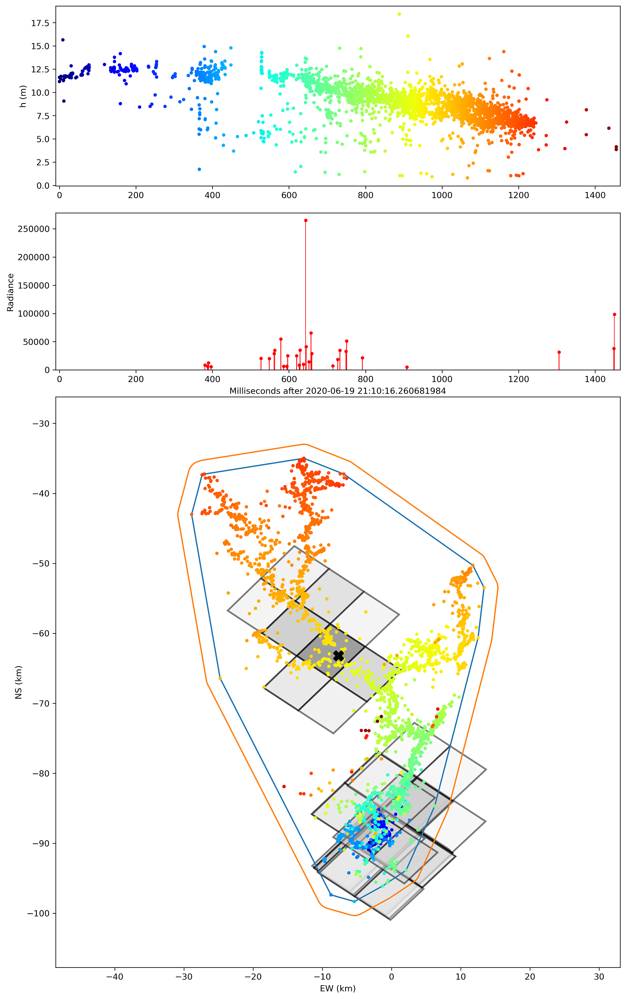

# Validation of  peformance of Lightning Imaging Sensor onboard International Space Station (ISS-LIS) using lightning mapping array (LMA) datasets

## Dependences other than some standard packages (e.g., numpy, pandas, shapely)
pyltg package for some handy functions for LIS data
<https://github.com/pbitzer/pyltg/>

astral for determinting the sunrise/sunset time at a give location
<https://astral.readthedocs.io/en/latest/>

pymap3d for (lat,lon,alt) <==> (x,y,z) coordinates conversion
<https://github.com/geospace-code/pymap3d>

## Overview of this repo:
Scripts in thie repo serves to 
1. [Save_passover_LIS_filenames.py](https://github.com/safelysparky/LIS_LMA_val/blob/main/Save_passover_LIS_filenames.py) finds LIS .nc files that contain LIS flashes over a LMA network. 
2. [LIS_LMA_match.py](https://github.com/safelysparky/LIS_LMA_val/blob/main/LIS_LMA_match.py) finds LIS events matching the LMA flashes, and save all matches in a dictionary.
3. [LIS_DE_analysis_against_LMA.py](https://github.com/safelysparky/LIS_LMA_val/blob/main/LIS_DE_analysis_against_LMA.py) calculates the detection efficiency of LIS using LMA flashes as ground-truth.
4. [pkl_json_conversion.py](https://github.com/safelysparky/LIS_LMA_val/blob/main/pkl_json_conversion.py) coverts the .pkl file to JSON format

## Further info regarding each script:
1. [Save_passover_LIS_filenames.py](https://github.com/safelysparky/LIS_LMA_val/blob/main/Save_passover_LIS_filenames.py) looks for .nc files (in a specified folder) containing LIS flashes over the LMA network given the LMA center coordinates and the searching radius in km. Paths of .nc files with LIS flashes over the LMA will be saved in a .txt file.
2. [LIS_LMA_match.py](https://github.com/safelysparky/LIS_LMA_val/blob/main/LIS_LMA_match.py) reads the .nc files whose filenames are saved in a .txt file by the [Save_passover_LIS_filenames.py](https://github.com/safelysparky/LIS_LMA_val/blob/main/Save_passover_LIS_filenames.py). During the period of LIS passover the LMA, the correspoidng LMA file(s) (in a specified folder) will be searched and loaded (if found). LMA L1 data will be sorted into flashes using a spatial and temporal thresholds. There is addtional option to include ENTLN CG datasets to determine the type (IC/CG) of each LMA flash. Each of the sorted lma flashes will be further checked if they are within the FOV of LIS at the flash occurrence. If yes, the corresponding LIS events will be searched and saved (if any). A lma flash is considered detected by the LIS if any of the LIS event pixels intersect with the LMA convext hull (with some buffer to account for the LIS location offset). As the final product, each of the LMA flashes's L1 data will be saved in a dictionary, along with coreesponding LIS events (if detected by LIS), and also ENTLN CG data (if any). 
3. [LIS_DE_analysis_against_LMA.py](https://github.com/safelysparky/LIS_LMA_val/blob/main/LIS_DE_analysis_against_LMA.py) Compute the LIS detection efficiecny vs different LMA flash variable (e.g. flash area, flash source altitude) as well as the detection efficiency as a function of px py (location of CCD pixel). A plot function is also included in this script to plot LIS events overlaid on a LMA flash. 

4. [pkl_json_conversion.py](https://github.com/safelysparky/LIS_LMA_val/blob/main/pkl_json_conversion.py) converts the .pkl file generated by [LIS_LMA_match.py](https://github.com/safelysparky/LIS_LMA_val/blob/main/LIS_LMA_match.py) to JSON format (a more universal format than pkl), which is helpful to those using other languages (e.g. Matlab, IDL) that might have difficulty in directly loading the generated .pkl files.
 
## Contact
Please contact Yanan Zhu <yz0022@uah.edu> if you found any issue or have any questions. 